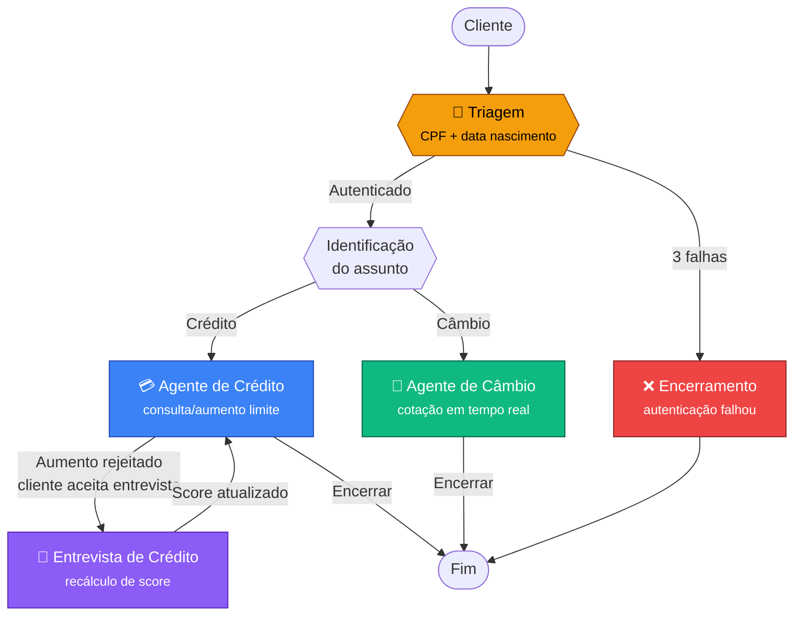

# Banco Ágil — Sistema de Atendimento Bancário com Agentes de IA

Sistema de atendimento ao cliente para o **Banco Ágil**, um banco digital fictício. O atendimento é realizado por **4 agentes de IA especializados**, orquestrados via [LangGraph](https://github.com/langchain-ai/langgraph), com transições transparentes — o cliente percebe um único atendente.

**Stack:** Python 3.12+ · LangGraph · LangChain · Google Gemini · Streamlit · Pandas

---

## Visão Geral

O sistema implementa um chatbot bancário inteligente que combina:

- **Autenticação** contra base de dados (CSV) com validação de CPF + data de nascimento
- **Consulta e aumento de limite de crédito** com verificação de score
- **Entrevista de crédito conversacional** para recálculo de score
- **Cotação de câmbio em tempo real** via API externa
- **Interface Streamlit** com visual bancário premium

Cada agente tem escopo bem definido e as transições entre eles são **invisíveis** para o cliente, criando a experiência de um único atendente com múltiplas habilidades.

---

## Arquitetura do Sistema

### Pipeline de Agentes



### Agentes

| Agente            | Responsabilidade                                                | Interação com Dados                                                                     |
| ----------------- | --------------------------------------------------------------- | --------------------------------------------------------------------------------------- |
| **🚦 Triagem**    | Autenticação (CPF + data nascimento, 3 tentativas) e roteamento | Leitura: `clientes.csv`                                                                 |
| **💳 Crédito**    | Consulta limite, solicitação de aumento, aprovação/rejeição     | Leitura: `clientes.csv`, `score_limite.csv`; Escrita: `solicitacoes_aumento_limite.csv` |
| **📝 Entrevista** | 5 perguntas financeiras → recálculo de score                    | Escrita: `clientes.csv` (atualiza score)                                                |
| **💱 Câmbio**     | Cotação em tempo real via AwesomeAPI                            | Leitura: API externa                                                                    |

### Dados

```
data/
├── clientes.csv                    # Base de clientes (CPF, nome, score, limite)
├── score_limite.csv                # Tabela: faixa de score → limite máximo
└── solicitacoes_aumento_limite.csv # Registro de pedidos de aumento
```

**Modelo de dados — clientes.csv:**

| Campo             | Tipo   | Descrição                   |
| ----------------- | ------ | --------------------------- |
| `cpf`             | string | CPF do cliente (11 dígitos) |
| `nome`            | string | Nome completo               |
| `data_nascimento` | date   | Formato YYYY-MM-DD          |
| `score`           | int    | Score de crédito (0-1000)   |
| `limite_credito`  | float  | Limite atual em R$          |

**Modelo de dados — solicitacoes_aumento_limite.csv:**

| Campo                    | Tipo      | Descrição                             |
| ------------------------ | --------- | ------------------------------------- |
| `cpf_cliente`            | string    | CPF do solicitante                    |
| `data_hora_solicitacao`  | timestamp | ISO 8601                              |
| `limite_atual`           | float     | Limite no momento da solicitação      |
| `novo_limite_solicitado` | float     | Valor solicitado                      |
| `status_pedido`          | string    | `pendente`, `aprovado` ou `rejeitado` |

### Fórmula de Score

O Agente de Entrevista calcula o score com a seguinte fórmula ponderada:

```python
score = (
    (renda_mensal / (despesas + 1)) * 30        # componente de renda
    + peso_emprego[tipo_emprego]                 # formal=300, autônomo=200, desempregado=0
    + peso_dependentes[num_dependentes]          # 0=100, 1=80, 2=60, 3+=30
    + peso_dividas[tem_dividas]                  # não=100, sim=-100
)
# Resultado: clamped entre 0 e 1000
```

---

## Funcionalidades Implementadas

### ✅ Requisitos Obrigatórios

| Requisito                                   | Implementação                                                      |
| ------------------------------------------- | ------------------------------------------------------------------ |
| Agente de Triagem com autenticação          | CPF + data nascimento, 3 tentativas, handoff automático            |
| Agente de Crédito com aumento de limite     | Consulta, solicitação, verificação de score, aprovação/rejeição    |
| Agente de Entrevista com recálculo de score | 5 perguntas conversacionais, fórmula ponderada, atualização em CSV |
| Agente de Câmbio com API externa            | AwesomeAPI (real-time, sem key), múltiplas moedas                  |
| Transições implícitas entre agentes         | Cliente percebe um único atendente                                 |
| Encerramento a qualquer momento             | Detecção de intenção de saída em qualquer agente                   |
| Tratamento de erros                         | CSV inexistente, API indisponível, input inválido                  |
| Interface Streamlit                         | Chat com visual bancário, sidebar com status do sistema            |

### ⭐ Diferenciais

- **Visual premium** na interface Streamlit (dark theme bancário, badges de status, avatares)
- **Parsing robusto** de inputs — aceita CPF com/sem formatação, datas em múltiplos formatos, valores monetários em formato brasileiro
- **Handoffs bidirecionais** — Crédito ↔ Entrevista de Crédito (rejeição → entrevista → novo crédito)
- **Sidebar de debug** — mostra agente ativo, status de autenticação, dados do cliente (invisível em produção)
- **AwesomeAPI** — cotação real em tempo real, sem necessidade de API key
- **Fórmula de score configurável** — pesos em constantes, fácil de ajustar

---

## Desafios Enfrentados e Soluções

### 1. Estado conversacional entre agentes

**Desafio:** Manter contexto de autenticação, dados do cliente e progresso da entrevista entre múltiplos agentes sem perder informação.

**Solução:** `TypedDict` (`BankState`) com campos tipados, gerenciado pelo LangGraph. O `add_messages` do LangGraph acumula o histórico automaticamente, e cada agente lê/escreve apenas os campos que precisa.

### 2. Parsing de inputs do usuário

**Desafio:** Usuários informam CPF como `123.456.789-01` ou `12345678901`, datas como `15/05/1990` ou `1990-05-15`, valores como `R$ 5.000,00` ou `5000`.

**Solução:** Funções de normalização (`_extract_cpf`, `_normalize_date`, `_extract_value`) com regex + múltiplos formatos. Fallback para LLM quando regex não resolve.

### 3. Handoff bidirecional Crédito ↔ Entrevista

**Desafio:** Após rejeição do aumento, o cliente pode aceitar a entrevista, recalcular score, e voltar ao crédito — tudo de forma transparente.

**Solução:** O campo `current_agent` no state controla o roteamento. Cada agente pode alterar esse campo para redirecionar. O LangGraph usa conditional edges para rotear dinamicamente.

### 4. Entrevista sequencial com validação

**Desafio:** Coletar 5 dados financeiros de forma conversacional, validando cada resposta antes de avançar.

**Solução:** Lista de perguntas com tipos esperados (`float`, `employment`, `int`, `boolean`). Parser específico por tipo com mensagens de erro contextualizadas. O progresso é armazenado em `interview_data`.

---

## Escolhas Técnicas e Justificativas

| Decisão                      | Alternativa considerada            | Justificativa                                                                                                           |
| ---------------------------- | ---------------------------------- | ----------------------------------------------------------------------------------------------------------------------- |
| **LangGraph**                | Google ADK, CrewAI, LangChain puro | Controle fino do grafo: conditional edges, state tipado, roteamento dinâmico. Cada agente é um nó testável isoladamente |
| **Gemini 2.5 Flash**         | GPT-4, Groq                        | Free tier sem custo, qualidade suficiente para o case. Pragmatismo: demonstra que o sistema funciona sem gastar         |
| **AwesomeAPI**               | Tavily, SerpAPI                    | Pública, sem key, dados reais do BCB. Zero configuração extra                                                           |
| **Streamlit**                | Chainlit, Gradio                   | Solicitado no desafio. Rápido de implementar, bom para demos. Chat nativo com `st.chat_message`                         |
| **Pandas** para CSV          | csv stdlib, SQLite                 | Read/write simples, filtering expressivo, bom para escala dos dados do case                                             |
| **Regex + LLM** para parsing | Só LLM, só regex                   | Regex pega formatos óbvios (custo zero). LLM entra como fallback para ambiguidades                                      |
| **TypedDict** state          | Pydantic, dataclass                | Compatibilidade nativa com LangGraph, sem overhead de serialização                                                      |
| **Sem Docker**               | Docker Compose                     | Simplifica setup e avaliação. O foco do case é a qualidade dos agentes, não infra                                       |

Decisões detalhadas em [ADRs](docs/adr/):

- [ADR-001: LangGraph como Orquestrador](docs/adr/001-langgraph-orchestrator.md)
- [ADR-002: Gemini Free Tier](docs/adr/002-gemini-free-tier.md)
- [ADR-003: Estado Conversacional](docs/adr/003-conversational-state.md)

---

## Estrutura do Projeto

```
banco-agil-agents/
├── app.py                          # Streamlit UI (entry point)
├── pyproject.toml                  # Config (pytest + ruff)
├── requirements.txt                # Dependências
├── .env.example                    # Template de variáveis
│
├── data/                           # Dados simulados
│   ├── clientes.csv                # Base de clientes (5 registros)
│   ├── score_limite.csv            # Tabela score → limite
│   └── solicitacoes_aumento_limite.csv
│
├── docs/adr/                       # Architecture Decision Records
│   ├── 001-langgraph-orchestrator.md
│   ├── 002-gemini-free-tier.md
│   └── 003-conversational-state.md
│
├── src/
│   ├── config.py                   # Variáveis de ambiente
│   ├── schemas/
│   │   └── state.py                # TypedDict do estado (BankState)
│   ├── core/
│   │   ├── llm_factory.py          # Abstração LLM (Gemini/OpenAI)
│   │   └── graph.py                # Orquestrador LangGraph
│   ├── agents/
│   │   ├── triage.py               # Agente de Triagem
│   │   ├── credit.py               # Agente de Crédito
│   │   ├── credit_interview.py     # Agente de Entrevista de Crédito
│   │   └── exchange.py             # Agente de Câmbio
│   └── tools/
│       ├── csv_tools.py            # Operações CSV
│       ├── exchange_api.py         # Cliente AwesomeAPI
│       └── score_calculator.py     # Fórmula de score
│
└── tests/                          # Testes unitários
    ├── test_csv_tools.py
    ├── test_score_calculator.py
    ├── test_triage.py
    ├── test_credit.py
    ├── test_credit_interview.py
    ├── test_exchange.py
    └── test_graph.py
```

---

## Tutorial de Execução e Testes

### Pré-requisitos

- Python ≥ 3.12
- Chave de API do Google Gemini ([obter aqui](https://aistudio.google.com/apikey))

### 1. Clone e configure

```bash
git clone <repo-url>
cd banco-agil-agents
```

### 2. Ambiente virtual e dependências

```bash
python -m venv .venv && source .venv/bin/activate
pip install -r requirements.txt
```

### 3. Variáveis de ambiente

```bash
cp .env.example .env
# Edite .env e preencha GOOGLE_API_KEY
```

### 4. Executar a aplicação

```bash
streamlit run app.py
```

A interface abre em `http://localhost:8501`.

### 5. Testes

```bash
# Todos os testes (mocked, sem API key)
pytest

# Testes específicos
pytest tests/test_csv_tools.py -v
pytest tests/test_score_calculator.py -v
```

### 6. Fluxo de teste sugerido

1. **Autenticar:** CPF `12345678901`, nascimento `15/05/1990` → Ana Silva
2. **Consultar crédito:** "quero ver meu limite" → Score 750, Limite R$ 5.000
3. **Aumentar limite (aprovado):** "quero aumentar para 7000" → Aprovado (score 750 permite até R$ 8.000)
4. **Aumentar limite (rejeitado):** Autenticar como `98765432100` (score 400), pedir R$ 5.000 → Rejeitado
5. **Entrevista de crédito:** Aceitar entrevista, responder 5 perguntas → Score recalculado
6. **Câmbio:** "qual a cotação do dólar?" → Cotação em tempo real

---

## Licença

Case técnico — uso para avaliação.
