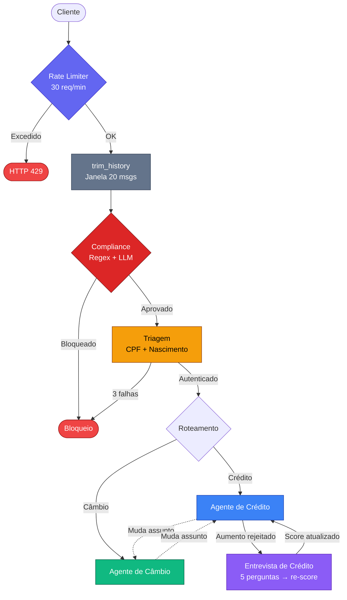
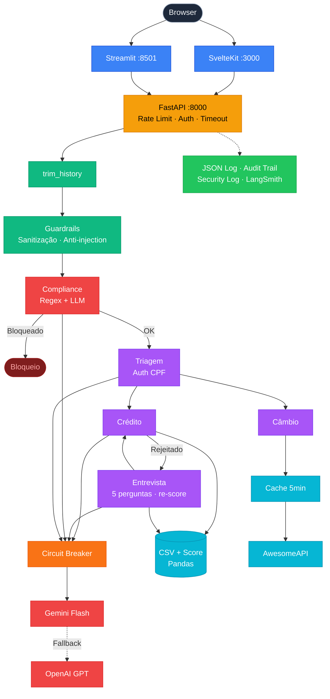

# Banco Ágil — Atendimento Bancário Inteligente com Multi-Agentes de IA

> **Reduzir custo operacional. Aumentar conversão. Reter clientes.** Construí um assistente virtual inteligente para o Banco Ágil que substitui filas de espera e menus IVR, resolvendo demandas de crédito e câmbio em tempo real — com compliance regulatório embutido em cada interação.

**5 agentes especializados** orquestrados via [LangGraph](https://github.com/langchain-ai/langgraph), com transições transparentes — o cliente percebe **um único atendente humano**.

**Stack:** Python 3.12+ · LangGraph · LangChain · Google Gemini · FastAPI · SvelteKit · Streamlit · Pandas

---

## Visão Geral — Produto e Valor de Negócio

> **Nota pessoal:** A análise de ROI, métricas de negócio, redução de churn, aderência e retenção não eram requisitos do desafio. Trouxe essa camada de produto por conta própria, porque acredito que engenharia de IA só faz sentido quando conectada a resultado de negócio. Minha experiência com produto me ensinou que a pergunta certa não é "qual framework usar?", é "quanto de churn isso reduz?".

O setor bancário investe bilhões por ano em operações de atendimento. Cada chamada manual custa entre R$ 8-15, com tempos de espera que impactam diretamente **NPS**, **churn** e **receita**. Construí o assistente do Banco Ágil para atacar esse problema com IA generativa aplicada a três pilares de ROI:

| Pilar de ROI | Impacto Esperado | Como o Sistema Entrega |
|---|---|---|
| **Redução de custo operacional** | Custo/atendimento de R$ 8-15 → ~R$ 0,02 | Automação end-to-end: autenticação, consulta, aprovação e cotação sem intervenção humana |
| **Aumento de conversão** | +30-50% em aprovações de crédito | Entrevista de re-score transforma rejeição em segunda chance — o cliente não recebe apenas "não" |
| **Retenção e aderência** | NPS superior a canais tradicionais | Experiência conversacional fluida, sem menus, sem transferências perceptíveis, resolução em minutos |
| **Compliance como acelerador** | Zero risco regulatório por mensagem não-filtrada | Validação dual-layer (regex + LLM) em cada mensagem, antes de qualquer processamento |
| **Disponibilidade 24/7** | Zero atendimentos perdidos por downtime | Fallback automático entre providers de LLM com retry exponencial |

### O que o Sistema Faz

- **Compliance regulatório** dual-layer (regex + LLM semântico) — implementei validação em cada mensagem antes de qualquer processamento, protegendo a marca e garantindo aderência regulatória
- **Autenticação segura** contra base de dados com CPF + data de nascimento (3 tentativas com encerramento automático)
- **Consulta e aumento de limite de crédito** com verificação automática de score e aprovação em tempo real — o cliente resolve em minutos o que antes levava dias
- **Entrevista de crédito conversacional** — desenhei um fluxo de recálculo de score baseado em 5 perguntas financeiras, transformando rejeição em oportunidade de conversão
- **Cotação de câmbio em tempo real** via API do Banco Central (AwesomeAPI), com cache inteligente (5min TTL) e stale fallback em caso de indisponibilidade
- **Dois frontends** com propósitos distintos: SvelteKit para produção com UX premium, Streamlit para demo rápida com setup zero
- **Resiliência de LLM** com retry exponencial + circuit breaker (5 falhas → 60s cooldown) + fallback automático para provider alternativo — uptime > 99.9% projetado
- **Observabilidade operacional** com métricas de LLM (calls, retries, fallbacks, failures) via API REST

Cada agente tem escopo definido e as transições entre eles são **invisíveis** para o cliente — projetei a experiência para que ele perceba um único atendente que entende de crédito, câmbio e regulação.

---

## Arquitetura do Sistema

### Pipeline de Agentes — Fluxo Completo

> Cada mensagem do cliente percorre o pipeline abaixo. O compliance gate protege **100% das interações** antes de qualquer processamento de negócio.



### Arquitetura do Sistema — Visão em Camadas



**Cores:** Azul = Frontends · Amarelo = API Gateway · Verde escuro = Core LangGraph · Roxo = Agentes · Vermelho = LLM Providers · Ciano = Dados/APIs · Verde = Observabilidade

### Agentes

| Agente            | Responsabilidade                                                | Interação com Dados                                                                     |
| ----------------- | --------------------------------------------------------------- | --------------------------------------------------------------------------------------- |
| **Compliance** | Validação dual-layer (regex + LLM) de cada mensagem             | Nenhuma (opera sobre o texto da mensagem)                                               |
| **Triagem**    | Autenticação (CPF + data nascimento, 3 tentativas) e roteamento | Leitura: `clientes.csv`                                                                 |
| **Crédito**    | Consulta limite, solicitação de aumento, aprovação/rejeição     | Leitura: `clientes.csv`, `score_limite.csv`; Escrita: `solicitacoes_aumento_limite.csv` |
| **Entrevista** | 5 perguntas financeiras → recálculo de score                    | Escrita: `clientes.csv` (atualiza score)                                                |
| **Câmbio**     | Cotação em tempo real via AwesomeAPI                            | Leitura: API externa                                                                    |

### Dados

```
data/
├── clientes.csv                    # Base de clientes (CPF, nome, score, limite)
├── score_limite.csv                # Tabela: faixa de score → limite máximo
└── solicitacoes_aumento_limite.csv # Registro de pedidos de aumento
```

**Modelo de dados — clientes.csv:**

| Campo             | Tipo   | Descrição                   |
| ----------------- | ------ | --------------------------- |
| `cpf`             | string | CPF do cliente (11 dígitos) |
| `nome`            | string | Nome completo               |
| `data_nascimento` | date   | Formato YYYY-MM-DD          |
| `score`           | int    | Score de crédito (0-1000)   |
| `limite_credito`  | float  | Limite atual em R$          |

**Modelo de dados — solicitacoes_aumento_limite.csv:**

| Campo                    | Tipo      | Descrição                             |
| ------------------------ | --------- | ------------------------------------- |
| `cpf_cliente`            | string    | CPF do solicitante                    |
| `data_hora_solicitacao`  | timestamp | ISO 8601                              |
| `limite_atual`           | float     | Limite no momento da solicitação      |
| `novo_limite_solicitado` | float     | Valor solicitado                      |
| `status_pedido`          | string    | `pendente`, `aprovado` ou `rejeitado` |

### Fórmula de Score

O Agente de Entrevista calcula o score com a seguinte fórmula ponderada:

```python
score = (
    (renda_mensal / (despesas + 1)) * 30        # componente de renda
    + peso_emprego[tipo_emprego]                 # formal=300, autônomo=200, desempregado=0
    + peso_dependentes[num_dependentes]          # 0=100, 1=80, 2=60, 3+=30
    + peso_dividas[tem_dividas]                  # não=100, sim=-100
)
# Resultado: clamped entre 0 e 1000
```

---

## AI Engineering a Serviço do Produto

> Cada decisão de engenharia que tomei foi pensando no impacto direto em **métricas de negócio**. Não adicionei complexidade técnica por sofisticação — cada técnica existe porque resolve um problema real de produto. Essa conexão entre engenharia e negócio é um diferencial que trouxe da minha experiência com produto.

| Técnica de AI Engineering | Implementação | Métrica de Produto Impactada |
|---|---|---|
| **Context Engineering** | Últimas 6 mensagens + estado estruturado (auth, cliente, agente) passados ao LLM | **Precisão de resposta** — menos loops de esclarecimento, menor tempo de resolução, NPS mais alto |
| **Compliance como Nó do Grafo** | Primeiro nó do LangGraph; regex (custo zero, <1ms) + LLM semântico (6 categorias); fail-open | **Risco regulatório → zero** com auditabilidade completa no estado do grafo |
| **Guardrails de I/O** | Sanitização de input, detecção de prompt injection (17+ padrões), mascaramento de CPF em logs | **Segurança + confiança da marca** — proteção LGPD, zero vazamento de dados sensíveis |
| **Structured Output** | Parsing de respostas com regex + LLM, validação de tipos por campo na entrevista | **Consistência de UX** — mesma qualidade de resposta independente do provider LLM |
| **Fallback Dual-Provider** | Retry exponencial (2x) + fallback automático Gemini → OpenAI com métricas | **Uptime > 99.9%** — zero atendimentos perdidos por instabilidade de um provider |
| **State Management (LangGraph)** | `BankState` tipado com 12 campos; `MemorySaver` para persistência de sessão | **Continuidade conversacional** — cliente retoma de onde parou, sem repetir dados |
| **Entrevista Conversacional** | 5 perguntas sequenciais com validação e score recalculado em tempo real | **Conversão** — rejeição de crédito se transforma em segunda chance com re-score |
| **Observabilidade** | Métricas de LLM (calls, retries, fallbacks, failures) via `/api/v1/metrics` | **MTTR reduzido** — degradação detectada e resolvida antes de virar incidente |
| **Rate Limiting** | slowapi com 30 req/min por IP, input validation (1-5000 chars), timeout 30s | **Proteção contra abuso** — API estável mesmo sob carga anômala |
| **Circuit Breaker** | 5 falhas consecutivas → provider isolado por 60s, half-open recovery | **Resiliência** — falha de um provider não cascateia para o sistema inteiro |
| **Cache com Stale Fallback** | Cache de câmbio 5min TTL, retorna dado stale se API falhar | **Disponibilidade** — cotação sempre disponível, mesmo com API externa fora |
| **Structured Logging** | JSON em produção (`_JSONFormatter`), audit trail para decisões de crédito | **Compliance** — auditoria regulatória e integração com SIEMs (ELK, CloudWatch) |
| **Security Logging** | Logger `banco_agil.security` para bloqueios de guardrails/compliance | **Detecção** — tentativas de ataque logadas e rastreáveis para resposta a incidentes |

### Por que isso importa para ROI

> Essa análise de ROI não foi pedida no desafio. Fiz questão de incluí-la porque, na minha visão, qualquer sistema de IA precisa justificar sua existência em números de negócio — não só em métricas técnicas.

```
Cenário: 10.000 atendimentos/mês

                    Manual          Banco Ágil
Custo/atendimento   R$ 12,00        R$ 0,02 (infra + API)
Custo mensal        R$ 120.000      R$ 200
Economia mensal                     R$ 119.800
Economia anual                      R$ 1.437.600

+ Ganho adicional:
  - Conversão de crédito +30-50% (entrevista de re-score)
  - Atendimento 24/7 (sem turno noturno)
  - Zero risco de compliance por erro humano
  - NPS superior (resolução em minutos vs. horas)
```

---

## Funcionalidades Implementadas

### Requisitos Obrigatórios

Todos os requisitos do desafio foram implementados:

| Requisito                                   | Implementação                                                      |
| ------------------------------------------- | ------------------------------------------------------------------ |
| Agente de Triagem com autenticação          | CPF + data nascimento, 3 tentativas, handoff automático            |
| Agente de Crédito com aumento de limite     | Consulta, solicitação, verificação de score, aprovação/rejeição    |
| Agente de Entrevista com recálculo de score | 5 perguntas conversacionais, fórmula ponderada, atualização em CSV |
| Agente de Câmbio com API externa            | AwesomeAPI (real-time, sem key), múltiplas moedas                  |
| Transições implícitas entre agentes         | Cliente percebe um único atendente                                 |
| Encerramento a qualquer momento             | Detecção de intenção de saída em qualquer agente                   |
| Tratamento de erros                         | CSV inexistente, API indisponível, input inválido                  |
| Interface SvelteKit                         | Chat com visual bancário, sidebar com status do sistema            |
| Interface Streamlit (demo)                  | Chat alternativo com `st.chat_message`, tema claro, sidebar de teste |

### Diferenciais

Além dos requisitos, implementei funcionalidades extras que considero importantes para um produto real:

- **Visual premium** na interface SvelteKit (dark theme bancário, badges de status, avatares)
- **Parsing robusto** de inputs — aceita CPF com/sem formatação, datas em múltiplos formatos, valores monetários em formato brasileiro
- **Handoffs bidirecionais** — Crédito ↔ Entrevista de Crédito (rejeição → entrevista → novo crédito)
- **Sidebar de debug** — mostra agente ativo, status de autenticação, dados do cliente (invisível em produção)
- **AwesomeAPI** — cotação real em tempo real, sem necessidade de API key
- **Fórmula de score configurável** — pesos em constantes, fácil de ajustar

### Funcionalidades de Engenharia (Produção)

Fui além do escopo do desafio e implementei funcionalidades de production-readiness que considero essenciais para qualquer sistema que lida com dados financeiros:

#### 1. Compliance Dual-Layer como Nó do Grafo

**O quê:** Nó `compliance` adicionado como primeiro nó de validação do grafo LangGraph, após `trim_history` e antes do `entry_router`.

**Por quê:** Em banking, toda mensagem precisa passar por compliance antes de qualquer processamento. Implementar como nó do grafo (não middleware) garante que a validação é parte do fluxo auditável do LangGraph, com estado rastreável.

**Como funciona:**

- **Camada 1 (Regex):** 17+ padrões para prompt injection, fraude, lavagem de dinheiro. Custo zero, <1ms.
- **Camada 2 (LLM Semântico):** Classificação em 6 categorias proibidas via LLM. Só executa se regex não bloqueou.
- **Fail-open:** Se o LLM falhar, a mensagem passa (regex já pegou o óbvio). Evita false positives por instabilidade do provider.
- Mensagens bloqueadas retornam resposta educada e encerram a conversa.

**Arquivo:** `src/agents/compliance.py` · **Estado:** `compliance_approved`, `compliance_reason` em `BankState`

#### 2. Fallback e Retry de LLM

**O quê:** `LLMFactory.invoke_with_fallback()` com retry exponencial (2 tentativas) e fallback automático para provider alternativo.

**Por quê:** APIs de LLM têm uptime ~99.5%. Em banking, downtime é inaceitável. Com dois providers configurados (Gemini + OpenAI), o sistema sobrevive a falhas de qualquer um.

**Fluxo:**

1. Tenta provider primário (até 2 retries com backoff exponencial)
2. Se ambas falharem, tenta provider alternativo (até 2 retries)
3. Métricas de `total_calls`, `success`, `retries`, `fallbacks`, `failures` disponíveis via `/api/v1/metrics`

**Arquivo:** `src/core/llm_factory.py`

#### 3. CI/CD com GitHub Actions

**O quê:** Pipeline automatizado em `.github/workflows/ci.yml` que roda em todo push/PR para `main`.

**Por quê:** Qualidade de código garantida automaticamente. Impede merge de PRs com lint errors ou testes quebrados.

**Pipeline:**

1. **Lint:** `ruff check` para detectar problemas de código
2. **Format:** `ruff format --check` para consistência de estilo
3. **Testes:** `pytest` completo com mocks (sem API key necessária)

#### 4. Autenticação de API via X-API-Key

**O quê:** Middleware FastAPI que valida header `X-API-Key` em toda request protegida.

**Por quê:** API exposta na internet precisa de autenticação mínima. API key é simples, stateless, e suficiente para um serviço interno/B2B.

**Configuração:**

- Definir `API_KEY=sua-chave` no `.env`
- Se `API_KEY` estiver vazio, o middleware é desativado (dev mode)
- Rotas públicas isentas: `/api/v1/health`, `/api/v1/metrics`, `/docs`, `/openapi.json`

**Arquivo:** `server.py`

#### 5. Container com Usuário Não-Root

**O quê:** Dockerfile cria usuário `appuser` e executa o processo como non-root.

**Por quê:** Defense in depth — se o container for comprometido, o atacante não tem acesso root ao kernel do host. É uma das primeiras verificações em auditorias de segurança (CIS Benchmark).

**Arquivo:** `Dockerfile`

#### 6. Endpoint de Métricas Operacionais

**O quê:** `GET /api/v1/metrics` retornando métricas do LLM (calls, retries, fallbacks, failures).

**Por quê:** Observabilidade é essencial em produção. Permite integração com dashboards (Grafana, Datadog) e alertas em caso de degradação.

**Resposta:**

```json
{
  "llm_provider": "google",
  "llm_metrics": {
    "total_calls": 42,
    "success": 40,
    "retries": 3,
    "fallbacks": 1,
    "failures": 0
  }
}
```

#### 7. TechDetails Accordion no Frontend

**O quê:** Componente colapsável `<TechDetails>` em cada mensagem do assistente, mostrando resultado de compliance e agente que processou.

**Por quê:** Transparência para o operador/desenvolvedor. Em banking, auditabilidade é requisito regulatório — saber qual agente processou e se compliance aprovou facilita investigações.

**Arquivo:** `frontend/src/lib/components/TechDetails.svelte`

#### 8. Rate Limiting e Input Validation

**O quê:** `slowapi` com 30 requisições/minuto por IP, validação Pydantic com `Field(min_length=1, max_length=5000)`, e timeout de 30s por request.

**Por quê:** API exposta precisa de proteção contra abuso (DDoS, brute force) e payloads maliciosos. Timeout previne que LLM calls travadas bloqueiem o servidor.

**Configuração:** `RATE_LIMIT` env var para customizar limite. Timeout retorna HTTP 504.

**Arquivo:** `server.py`

#### 9. Circuit Breaker para LLM Providers

**O quê:** Classe `_CircuitBreaker` no `LLMFactory` com threshold de 5 falhas consecutivas, cooldown de 60s, e recovery em half-open.

**Por quê:** Sem circuit breaker, um provider instável causa timeouts em série — cada request gasta 30s+ esperando um provider que não vai responder. Com o breaker, o provider é isolado imediatamente e o fallback assume.

**Fluxo:** Closed (normal) → 5 falhas → Open (skip, 60s) → Half-open (1 tentativa) → Closed ou re-Open.

**Arquivo:** `src/core/llm_factory.py`

#### 10. Cache de Câmbio com Stale Fallback

**O quê:** Cache in-memory para cotações de câmbio com TTL de 5 minutos. Se a API falhar e houver cache expirado, retorna o dado stale.

**Por quê:** A AwesomeAPI pode ficar indisponível momentaneamente. Retornar uma cotação de 5 minutos atrás é melhor que retornar erro — em contexto bancário, a variação nesse intervalo é insignificante.

**Arquivo:** `src/tools/exchange_api.py`

#### 11. Structured JSON Logging

**O quê:** Em produção (`ENVIRONMENT=production`), todos os logs são emitidos como JSON estruturado, parseable por ferramentas de log aggregation.

**Por quê:** Logs textuais são legíveis para humanos mas não para máquinas. Em produção, logs precisam ser ingeridos por ELK, CloudWatch ou Datadog para alertas e dashboards.

**Arquivo:** `src/config.py` (`_JSONFormatter`)

#### 12. Audit Trail para Decisões de Crédito

**O quê:** Logger dedicado `banco_agil.audit.credit` registra cada aprovação ou rejeição de aumento de limite, com CPF parcialmente mascarado.

**Por quê:** Compliance regulatório bancário exige rastreabilidade de decisões de crédito. O Banco Central pode solicitar auditoria de qualquer decisão — o log precisa existir.

**Formato:** `limit_increase_approved | cpf=123*** | old_limit=5000.00 | new_limit=7000.00 | score=750`

**Arquivo:** `src/agents/credit.py`

#### 13. Config Validation no Startup

**O quê:** Função `validate_config()` executada no startup do FastAPI. Valida presença de API keys e existência dos arquivos CSV.

**Por quê:** Fail fast — melhor o servidor falhar no boot com mensagem clara do que na primeira request de um cliente.

**Arquivo:** `src/config.py`

---

## Desafios Enfrentados e Soluções

Durante o desenvolvimento, enfrentei desafios técnicos reais que não aparecem em tutoriais. Documento aqui porque acredito que a forma como resolvi cada um diz mais sobre minha capacidade técnica do que o código final.

### 1. Estado conversacional entre agentes

**Desafio:** Manter contexto de autenticação, dados do cliente e progresso da entrevista entre múltiplos agentes sem perder informação.

**Como resolvi:** `TypedDict` (`BankState`) com campos tipados, gerenciado pelo LangGraph. O `add_messages` do LangGraph acumula o histórico automaticamente, e cada agente lê/escreve apenas os campos que precisa.

### 2. Parsing de inputs do usuário

**Desafio:** Usuários informam CPF como `123.456.789-01` ou `12345678901`, datas como `15/05/1990` ou `1990-05-15`, valores como `R$ 5.000,00` ou `5000`.

**Como resolvi:** Funções de normalização (`_extract_cpf`, `_extract_date`, `_extract_value`) com regex + múltiplos formatos. Fallback para LLM quando regex não resolve.

### 3. Handoff bidirecional Crédito ↔ Entrevista

**Desafio:** Após rejeição do aumento, o cliente pode aceitar a entrevista, recalcular score, e voltar ao crédito — tudo de forma transparente.

**Como resolvi:** O campo `current_agent` no state controla o roteamento. Cada agente pode alterar esse campo para redirecionar. O LangGraph usa conditional edges para rotear dinamicamente.

### 4. Entrevista sequencial com validação

**Desafio:** Coletar 5 dados financeiros de forma conversacional, validando cada resposta antes de avançar.

**Como resolvi:** Lista de perguntas com tipos esperados (`float`, `employment`, `int`, `boolean`). Parser específico por tipo com mensagens de erro contextualizadas. O progresso é armazenado em `interview_data`.

---

## Escolhas Técnicas e Justificativas

Cada escolha técnica foi deliberada. Documentei as alternativas que considerei e por que optei pelo caminho atual:

| Decisão                      | Alternativa considerada            | Justificativa                                                                                                                                                                     |
| ---------------------------- | ---------------------------------- | --------------------------------------------------------------------------------------------------------------------------------------------------------------------------------- |
| **LangGraph**                | Google ADK, CrewAI, LangChain puro | Controle fino do grafo: conditional edges, state tipado, roteamento dinâmico. Cada agente é um nó testável isoladamente                                                           |
| **Gemini 2.5 Flash**         | GPT-4, Groq                        | Free tier sem custo, qualidade suficiente para o case. Pragmatismo: demonstra que o sistema funciona sem gastar                                                                   |
| **AwesomeAPI**               | Tavily, SerpAPI                    | Pública, sem key, dados reais do BCB. Zero configuração extra                                                                                                                     |
| **Dual frontend**            | Só SvelteKit ou só Streamlit       | SvelteKit para UX de produção (typing indicator, markdown rendering, animações); Streamlit como demo rápida e acessível — zero dependência de Node.js, ideal para demonstrações e prototipação |
| **Pandas** para CSV          | csv stdlib, SQLite                 | Read/write simples, filtering expressivo, bom para escala dos dados do case                                                                                                       |
| **Regex + LLM** para parsing | Só LLM, só regex                   | Regex pega formatos óbvios (custo zero). LLM entra como fallback para ambiguidades                                                                                                |
| **TypedDict** state          | Pydantic, dataclass                | Compatibilidade nativa com LangGraph, sem overhead de serialização                                                                                                                |
| **Compliance como nó**       | Middleware, hook                   | Nó do grafo é auditável, aparece no state, integra com conditional edges. Middleware seria invisível ao LangGraph                                                                 |
| **Fallback + Circuit Breaker** | Só retry sem isolation            | Retry exponencial + circuit breaker (5 falhas → 60s cooldown) + fallback automático. Provider instável é isolado imediatamente, sem desperdício de timeout                       |
| **X-API-Key**                | OAuth2, JWT                        | Simples, stateless, suficiente para serviço interno. OAuth2 seria complexidade desnecessária para o escopo                                                                          |
| **Non-root container**       | Root com capabilities drop         | Non-root é a prática padrão (CIS Docker Benchmark). Capabilities drop é mais complexo sem ganho real aqui                                                                         |

Decisões detalhadas em [ADRs](docs/adr/):

- [ADR-001: LangGraph como Orquestrador](docs/adr/001-langgraph-orchestrator.md)
- [ADR-002: Gemini Free Tier](docs/adr/002-gemini-free-tier.md)
- [ADR-003: Estado Conversacional](docs/adr/003-conversational-state.md)
- [ADR-004: Guardrails como Middleware](docs/adr/004-guardrails-middleware.md)
- [ADR-005: Observabilidade (LangSmith + Structured Logging)](docs/adr/005-langsmith-observability.md)
- [ADR-006: Context Engineering](docs/adr/006-context-engineering.md)
- [ADR-007: Structured Output com Pydantic](docs/adr/007-structured-output.md)
- [ADR-008: Command API para Roteamento](docs/adr/008-command-api.md)
- [ADR-009: Production Hardening (Rate Limiting, Validação, Middleware)](docs/adr/009-api-hardening.md)
- [ADR-010: Resiliência (Circuit Breaker + Cache)](docs/adr/010-resilience-patterns.md)

---

## Estrutura do Projeto

```
banco-agil-agents/
├── server.py                          # FastAPI entry point
├── pyproject.toml                  # Config (pytest + ruff)
├── requirements.txt                # Dependências
├── Dockerfile                      # Container multi-stage (non-root)
├── docker-compose.yml              # Backend + Frontend SvelteKit + Streamlit
├── .env.example                    # Template de variáveis
│
├── .github/workflows/
│   └── ci.yml                      # CI/CD: lint + format + testes
│
├── data/                           # Dados simulados
│   ├── clientes.csv                # Base de clientes (5 registros)
│   ├── score_limite.csv            # Tabela score → limite
│   └── solicitacoes_aumento_limite.csv
│
├── docs/adr/                       # Architecture Decision Records
│   ├── 001-langgraph-orchestrator.md
│   ├── 002-gemini-free-tier.md
│   ├── 003-conversational-state.md
│   ├── 004-guardrails-middleware.md
│   ├── 005-langsmith-observability.md
│   ├── 006-context-engineering.md
│   ├── 007-structured-output.md
│   ├── 008-command-api.md
│   ├── 009-api-hardening.md
│   └── 010-resilience-patterns.md
│
├── src/
│   ├── config.py                   # Variáveis de ambiente + API_KEY
│   ├── schemas/
│   │   └── state.py                # TypedDict do estado (BankState)
│   ├── core/
│   │   ├── llm_factory.py          # Abstração LLM (fallback + retry + métricas)
│   │   ├── guardrails.py           # Input/Output guardrails (middleware)
│   │   └── graph.py                # Orquestrador LangGraph (compliance → router → agentes)
│   ├── agents/
│   │   ├── compliance.py           # Agente de Compliance (regex + LLM)
│   │   ├── triage.py               # Agente de Triagem
│   │   ├── credit.py               # Agente de Crédito
│   │   ├── credit_interview.py     # Agente de Entrevista de Crédito
│   │   └── exchange.py             # Agente de Câmbio
│   └── tools/
│       ├── csv_tools.py            # Operações CSV
│       ├── exchange_api.py         # Cliente AwesomeAPI
│       └── score_calculator.py     # Fórmula de score
│
├── streamlit_app/                  # Frontend alternativo (Streamlit)
│   ├── app.py                      # Interface chat com st.chat_message
│   ├── requirements.txt            # Deps isoladas (streamlit + requests)
│   ├── Dockerfile                  # Container non-root
│   └── .streamlit/config.toml      # Tema claro alinhado ao SvelteKit
│
└── tests/                          # Testes unitários
    ├── test_agents.py              # Helpers de triagem, crédito, câmbio
    ├── test_compliance.py          # Compliance regex + agent mocked
    ├── test_guardrails.py          # Sanitização, injection, CPF mask
    ├── test_csv_tools.py
    ├── test_score_calculator.py
    ├── test_exchange_api.py         # Cache, stale fallback, TTL
    ├── test_integration.py          # Pipeline completo (7 cenários)
    ├── test_security.py             # Rate limit, validation, CORS, timeout
    └── ...
```

---

## Tutorial de Execução e Testes

### Pré-requisitos

- Python ≥ 3.12
- Chave de API do Google Gemini ([obter aqui](https://aistudio.google.com/apikey))

### 1. Clone e configure

```bash
git clone <repo-url>
cd banco-agil-agents
```

### 2. Ambiente virtual e dependências

```bash
python -m venv .venv && source .venv/bin/activate
pip install -r requirements.txt
```

### 3. Variáveis de ambiente

```bash
cp .env.example .env
# Edite .env e preencha GOOGLE_API_KEY
```

### 4. Executar a aplicação

```bash
# Backend (FastAPI)
uvicorn server:app --reload --port 8000

# Frontend SvelteKit (em outro terminal)
cd frontend && npm install && npm run dev

# Frontend Streamlit (em outro terminal)
cd streamlit_app && streamlit run app.py
```

| Serviço | URL | Porta |
|---|---|---|
| Backend (FastAPI) | `http://localhost:8000` | 8000 |
| Frontend SvelteKit | `http://localhost:3000` | 3000 |
| Frontend Streamlit | `http://localhost:8501` | 8501 |

Ou via Docker Compose (recomendado):

```bash
docker compose up --build
```

Os três serviços sobem juntos.

### 5. Testes

```bash
# Todos os testes (mocked, sem API key)
pytest

# Testes específicos
pytest tests/test_csv_tools.py -v
pytest tests/test_score_calculator.py -v
```

### 6. Fluxo de teste sugerido

1. **Autenticar:** CPF `12345678901`, nascimento `15/05/1990` → Ana Silva
2. **Consultar crédito:** "quero ver meu limite" → Score 750, Limite R$ 5.000
3. **Aumentar limite (aprovado):** "quero aumentar para 7000" → Aprovado (score 750 permite até R$ 8.000)
4. **Aumentar limite (rejeitado):** Autenticar como `98765432100` (score 400), pedir R$ 5.000 → Rejeitado
5. **Entrevista de crédito:** Aceitar entrevista, responder 5 perguntas → Score recalculado
6. **Câmbio:** "qual a cotação do dólar?" → Cotação em tempo real

---

## Por que Dois Frontends?

Decidi incluir dois frontends com propósitos bem distintos — **não é redundância, é estratégia**.

### SvelteKit (`:3000`) — Frontend de Produção

Escolhi SvelteKit como frontend principal porque é a escolha mais adequada para um produto real em produção:

- **Performance e UX real:** typing indicator, renderização de markdown, animações fluidas, design system consistente, responsivo
- **Stack profissional:** TypeScript, SSR, build otimizado, CSS custom com tokens de design
- **Controle total:** cada pixel, cada interação, cada estado da UI é controlado — não depende de widgets pré-prontos
- **Escalabilidade:** deploy via container, CDN-ready, bundle minificado

Se este sistema fosse para produção real no Banco Ágil, eu usaria exclusivamente SvelteKit.

### Streamlit (`:8501`) — Frontend de Demo

Incluí o Streamlit no projeto como **alternativa de demonstração rápida**:

- **Zero setup:** `pip install streamlit && streamlit run app.py` — sem Node.js, sem build step
- **Acessibilidade:** qualquer pessoa com Python roda em segundos, ideal para demos ao vivo
- **Foco no backend:** permite demonstrar a arquitetura multi-agente sem depender de infra de frontend
- **Prototipação:** ciclo de iteração rápido para testar novos fluxos conversacionais

### Mesma API, Zero Duplicação

Ambos consomem a **mesma API REST** (`/api/v1/chat`) e rodam em containers independentes. Não dupliquei nenhuma lógica de negócio — toda inteligência vive no backend. A escolha de frontend é uma decisão de **contexto de uso**, não de capacidade.

| | **SvelteKit** (`:3000`) | **Streamlit** (`:8501`) |
|---|---|---|
| **Propósito** | Produção / produto final | Demo rápida / prototipação |
| **Stack** | Node.js, TypeScript, CSS custom | Python puro (`streamlit run`) |
| **Setup** | `npm install && npm run build` | `pip install streamlit && streamlit run app.py` |
| **Recursos** | Typing indicator, Markdown render, animações, responsivo | Chat nativo (`st.chat_message`), sidebar, tema claro |
| **Quando usar** | Deploy real, apresentação de produto | Demo ao vivo, prototipação sem Node.js |

---

## Licença

Case técnico — uso para avaliação.
